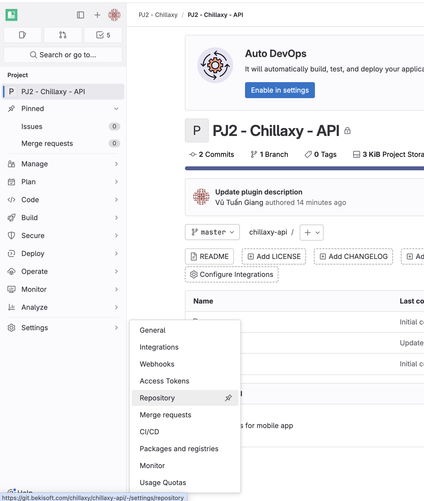
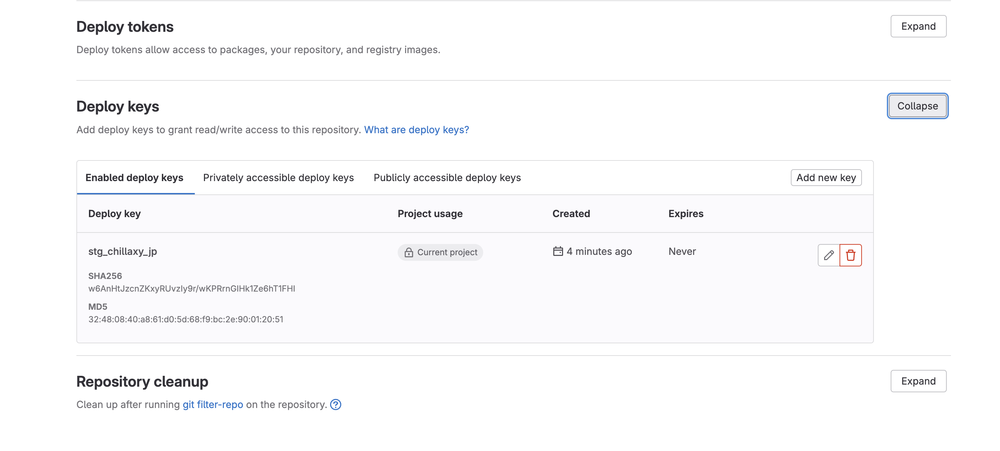

# Gitlab

## Generate deploy key

1. In deploy server, generate key pair
```bash
ssh-keygen -t ed25519 -C "<comment>"
```

2. Open repository setting page
```
Sidebar > Settings > Repository > Deploy key
```



3. Add new deploy key with public which you just generate in deploy server